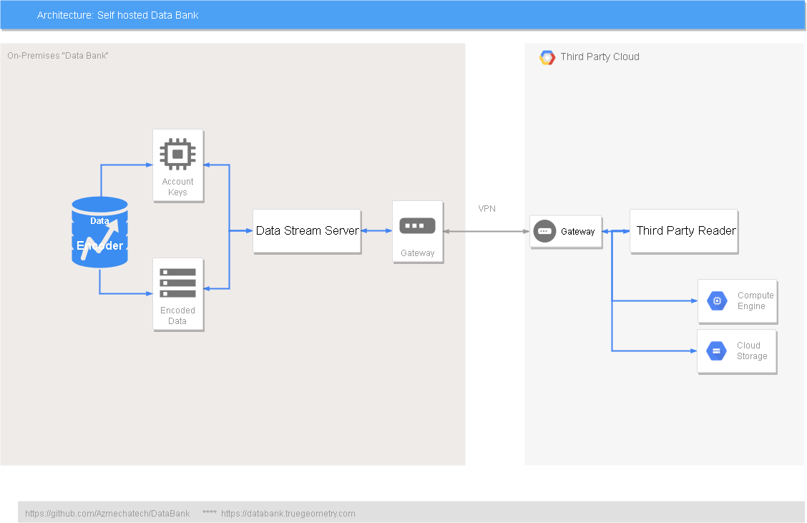

# DataBank
DataBank Concept, Libraries and utilities

This project is an attempt to promote decentralization of data while protecting the interests of individuals and organizations.
By desing the library and processes incorporated in this project will protect the sensitive information, and will only expose the data on which Statistics Models and AI/ML can be built. But the individual or organization will only be able to use the model for practical purposes if the original owner of the data discloses the "Account Key" that is generated when the data is encoded with help of "DataEncoder.ipynb" located in "jpynb" folder of this project.

The third-party can be of following types:
1. Researchers looking for context independent data set,
2. Researchers looking for context dependent data set,
3. Professionals/Consulting firms wanting to prove their expertise on your data set byt building POC models,
4. Professionals/Consulting firms employed by you but they are building models out side your IT infrastructure,

Strategy for sharing data with "Researchers looking for context independent data set" is to make the folder/directory "Bank/account1/" available on Github or any other public location on internet you own. For "Researchers looking for context dependent data set" one must approach you with a formal email. You must verify the authenticity of the researcher. Once verified the authenticity share the "accountAAA_sampleData1-CoMap.json" file located in "AccountKeys" folder. This will add some context to the data , but will not give out essential information that could be used to take business or personal advantage of the information without your permission. 

